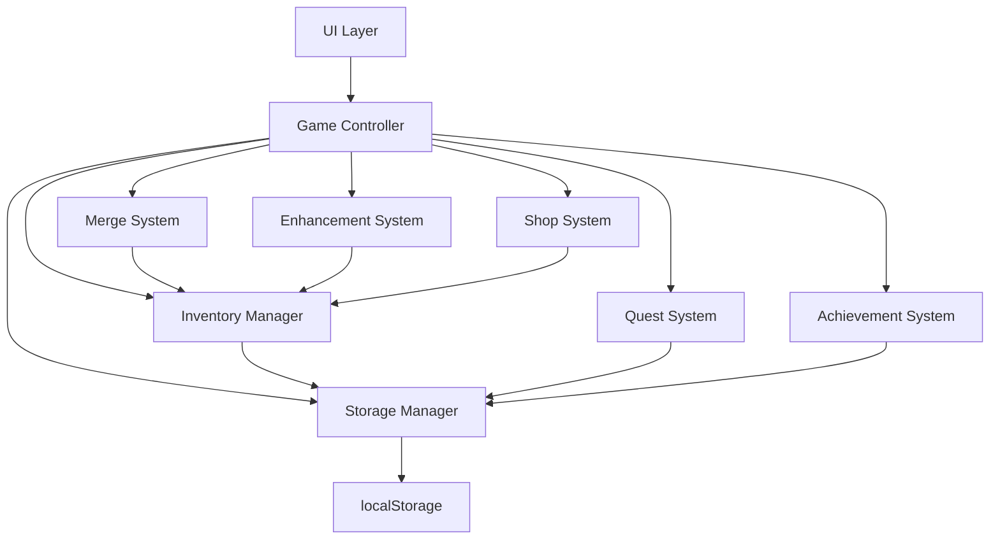

# Design Document: Sword Merge Game

## Overview

The Sword Merge Game is a browser-based idle game built with vanilla JavaScript, HTML5, and CSS3. The architecture follows a modular design pattern with clear separation between game logic, UI rendering, and data persistence. The game uses an event-driven architecture where user interactions trigger state changes, which then propagate to the UI layer for rendering.

The core gameplay loop involves:
1. Player acquires swords (purchase or lucky box)
2. Player organizes swords in 5x5 grid via drag-and-drop
3. Player merges identical-level swords to create higher-level swords
4. Player enhances swords with probability-based outcomes
5. Player sells swords for gold to continue the cycle

## Architecture

### High-Level Architecture



### Layer Responsibilities

**UI Layer**
- Renders game state to DOM
- Captures user input events (clicks, drags)
- Provides visual feedback for operations
- Updates displays in real-time

**Game Controller**
- Coordinates between all subsystems
- Manages game state transitions
- Handles event routing
- Triggers auto-save operations

**Core Systems**
- Each system manages its domain logic independently
- Systems communicate through the Game Controller
- State changes trigger UI updates via observer pattern

## Components and Interfaces

### 1. Sword Data Model

```javascript
interface Sword {
  id: string;              // Unique identifier (UUID)
  level: number;           // Base level (1-N)
  enhancement: number;     // Enhancement level (0-N)
  goldValue: number;       // Calculated gold value
}

function calculateGoldValue(level: number, enhancement: number): number {
  // Base value increases exponentially with level
  // Enhancement adds multiplicative bonus
  const baseValue = Math.pow(2, level - 1) * 10;
  const enhancementMultiplier = 1 + (enhancement * 0.5);
  return Math.floor(baseValue * enhancementMultiplier);
}
```

### 2. Inventory Manager

```javascript
interface InventorySlot {
  position: number;        // 0-24 (5x5 grid)
  sword: Sword | null;     // Sword or empty
}

class InventoryManager {
  slots: InventorySlot[];  // Array of 25 slots
  
  // Core operations
  addSword(sword: Sword, position?: number): boolean;
  removeSword(position: number): Sword | null;
  moveSword(fromPos: number, toPos: number): boolean;
  swapSwords(pos1: number, pos2: number): boolean;
  getSword(position: number): Sword | null;
  findEmptySlot(): number | null;
  isFull(): boolean;
  sortByLevel(): void;
  clear(): void;
  
  // Query operations
  getAllSwords(): Sword[];
  getTotalValue(): number;
  countSwords(): number;
}
```

### 3. Merge System

```javascript
class MergeSystem {
  canMerge(sword1: Sword, sword2: Sword): boolean;
  merge(sword1: Sword, sword2: Sword): Sword;
  
  // Merge validation
  private validateMerge(sword1: Sword, sword2: Sword): boolean {
    return sword1.level === sword2.level;
  }
  
  // Create merged sword
  private createMergedSword(level: number): Sword {
    return {
      id: generateUUID(),
      level: level + 1,
      enhancement: 0,
      goldValue: calculateGoldValue(level + 1, 0)
    };
  }
}
```

### 4. Enhancement System

```javascript
interface EnhancementConfig {
  successRate: number;     // Probability of success (0-1)
  maintainRate: number;    // Probability of maintain (0-1)
  destroyRate: number;     // Probability of destruction (0-1)
}

enum EnhancementResult {
  SUCCESS,
  MAINTAIN,
  DESTROY
}

class EnhancementSystem {
  getEnhancementConfig(enhancement: number): EnhancementConfig;
  enhance(sword: Sword): EnhancementResult;
  
  // Calculate probabilities based on current enhancement level
  private calculateProbabilities(enhancement: number): EnhancementConfig {
    // Success rate decreases as enhancement increases
    const successRate = Math.max(0.3, 0.9 - (enhancement * 0.1));
    const destroyRate = Math.min(0.5, enhancement * 0.1);
    const maintainRate = 1 - successRate - destroyRate;
    
    return { successRate, maintainRate, destroyRate };
  }
  
  // Execute enhancement with random outcome
  private rollEnhancement(config: EnhancementConfig): EnhancementResult {
    const roll = Math.random();
    if (roll < config.successRate) return EnhancementResult.SUCCESS;
    if (roll < config.successRate + config.maintainRate) return EnhancementResult.MAINTAIN;
    return EnhancementResult.DESTROY;
  }
}
```

### 5. Shop System

```javascript
interface ShopItem {
  id: string;
  name: string;
  cost: number;
  description: string;
}

class ShopSystem {
  private readonly BASIC_SWORD_COST = 20;
  private readonly LUCKY_BOX_COST = 100;
  
  purchaseBasicSword(playerGold: number, inventory: InventoryManager): PurchaseResult;
  purchaseLuckyBox(playerGold: number, inventory: InventoryManager): PurchaseResult;
  
  // Create basic level 1 sword
  private createBasicSword(): Sword {
    return {
      id: generateUUID(),
      level: 1,
      enhancement: 0,
      goldValue: calculateGoldValue(1, 0)
    };
  }
  
  // Create random level sword (1-5 with weighted probability)
  private createLuckyBoxSword(): Sword {
    const level = this.rollLuckyBoxLevel();
    return {
      id: generateUUID(),
      level: level,
      enhancement: 0,
      goldValue: calculateGoldValue(level, 0)
    };
  }
  
  private rollLuckyBoxLevel(): number {
    // Weighted random: 50% level 1, 25% level 2, 15% level 3, 7% level 4, 3% level 5
    const roll = Math.random();
    if (roll < 0.50) return 1;
    if (roll < 0.75) return 2;
    if (roll < 0.90) return 3;
    if (roll < 0.97) return 4;
    return 5;
  }
}

interface PurchaseResult {
  success: boolean;
  sword?: Sword;
  error?: string;
}
```

### 6. Quest System

```javascript
interface Quest {
  id: string;
  title: string;
  description: string;
  objective: QuestObjective;
  reward: number;
  completed: boolean;
  claimed: boolean;
}

interface QuestObjective {
  type: 'merge' | 'enhance' | 'sell' | 'purchase';
  target: number;
  current: number;
}

class QuestSystem {
  activeQuests: Quest[];
  
  generateDailyQuests(): Quest[];
  updateProgress(type: string, amount: number): void;
  checkCompletion(questId: string): boolean;
  claimReward(questId: string): number;
  
  // Check if objective is met
  private isObjectiveMet(objective: QuestObjective): boolean {
    return objective.current >= objective.target;
  }
  
  // Generate random daily quests
  private generateRandomQuests(): Quest[] {
    const templates = [
      { type: 'merge', target: 10, reward: 100, title: 'Merge Master' },
      { type: 'enhance', target: 5, reward: 150, title: 'Enhancement Expert' },
      { type: 'sell', target: 20, reward: 80, title: 'Merchant' },
      { type: 'purchase', target: 15, reward: 120, title: 'Collector' }
    ];
    
    // Select 3 random quests
    return this.selectRandomQuests(templates, 3);
  }
}
```

### 7. Achievement System

```javascript
interface Achievement {
  id: string;
  title: string;
  description: string;
  condition: AchievementCondition;
  unlocked: boolean;
  unlockedAt?: Date;
}

interface AchievementCondition {
  type: 'total_merges' | 'max_level' | 'total_gold' | 'total_enhancements';
  threshold: number;
  current: number;
}

class AchievementSystem {
  achievements: Achievement[];
  
  checkAchievements(stats: PlayerStats): Achievement[];
  unlockAchievement(achievementId: string): void;
  getProgress(achievementId: string): number;
  
  // Initialize all achievements
  private initializeAchievements(): Achievement[] {
    return [
      {
        id: 'first_merge',
        title: 'First Merge',
        description: 'Merge your first sword',
        condition: { type: 'total_merges', threshold: 1, current: 0 },
        unlocked: false
      },
      {
        id: 'merge_master',
        title: 'Merge Master',
        description: 'Perform 100 merges',
        condition: { type: 'total_merges', threshold: 100, current: 0 },
        unlocked: false
      },
      {
        id: 'level_10',
        title: 'Level 10 Sword',
        description: 'Create a level 10 sword',
        condition: { type: 'max_level', threshold: 10, current: 0 },
        unlocked: false
      },
      {
        id: 'gold_millionaire',
        title: 'Millionaire',
        description: 'Accumulate 1,000,000 gold',
        condition: { type: 'total_gold', threshold: 1000000, current: 0 },
        unlocked: false
      }
    ];
  }
}
```

### 8. Storage Manager

```javascript
interface GameState {
  version: string;
  player: PlayerState;
  inventory: InventorySlot[];
  quests: Quest[];
  achievements: Achievement[];
  stats: PlayerStats;
  lastSaved: Date;
}

interface PlayerState {
  gold: number;
}

interface PlayerStats {
  totalMerges: number;
  totalEnhancements: number;
  totalPurchases: number;
  totalSales: number;
  maxLevel: number;
  totalGoldEarned: number;
}

class StorageManager {
  private readonly STORAGE_KEY = 'sword_merge_game_save';
  private readonly CURRENT_VERSION = '1.0.0';
  
  saveGame(state: GameState): boolean;
  loadGame(): GameState | null;
  clearSave(): void;
  
  // Serialize game state to JSON
  private serialize(state: GameState): string {
    return JSON.stringify(state);
  }
  
  // Deserialize and validate game state
  private deserialize(data: string): GameState | null {
    try {
      const state = JSON.parse(data);
      return this.validateState(state) ? state : null;
    } catch (error) {
      console.error('Failed to deserialize game state:', error);
      return null;
    }
  }
  
  // Validate loaded state structure
  private validateState(state: any): boolean {
    return (
      state &&
      typeof state.version === 'string' &&
      state.player &&
      typeof state.player.gold === 'number' &&
      Array.isArray(state.inventory) &&
      state.inventory.length === 25
    );
  }
  
  // Create fresh game state
  createNewGameState(): GameState {
    return {
      version: this.CURRENT_VERSION,
      player: { gold: 100 },
      inventory: Array(25).fill(null).map((_, i) => ({ position: i, sword: null })),
      quests: [],
      achievements: [],
      stats: {
        totalMerges: 0,
        totalEnhancements: 0,
        totalPurchases: 0,
        totalSales: 0,
        maxLevel: 0,
        totalGoldEarned: 0
      },
      lastSaved: new Date()
    };
  }
}
```

### 9. Drag and Drop Handler

```javascript
class DragDropHandler {
  private draggedElement: HTMLElement | null;
  private draggedPosition: number | null;
  
  initializeDragDrop(inventoryManager: InventoryManager, mergeSystem: MergeSystem): void;
  
  // Handle drag start
  private onDragStart(event: DragEvent, position: number): void {
    this.draggedPosition = position;
    event.dataTransfer.effectAllowed = 'move';
    event.dataTransfer.setData('text/plain', position.toString());
    
    // Add visual feedback
    event.target.classList.add('dragging');
  }
  
  // Handle drag over
  private onDragOver(event: DragEvent): void {
    event.preventDefault();
    event.dataTransfer.dropEffect = 'move';
    
    // Highlight drop target
    event.target.classList.add('drag-over');
  }
  
  // Handle drop
  private onDrop(event: DragEvent, targetPosition: number, 
                 inventory: InventoryManager, mergeSystem: MergeSystem): void {
    event.preventDefault();
    
    const sourcePosition = this.draggedPosition;
    if (sourcePosition === null) return;
    
    const sourceSword = inventory.getSword(sourcePosition);
    const targetSword = inventory.getSword(targetPosition);
    
    // Check if merge is possible
    if (sourceSword && targetSword && mergeSystem.canMerge(sourceSword, targetSword)) {
      this.handleMerge(sourcePosition, targetPosition, inventory, mergeSystem);
    } else if (targetSword) {
      // Swap swords
      inventory.swapSwords(sourcePosition, targetPosition);
    } else {
      // Move to empty slot
      inventory.moveSword(sourcePosition, targetPosition);
    }
    
    // Clean up
    this.clearDragState();
  }
  
  private handleMerge(pos1: number, pos2: number, 
                     inventory: InventoryManager, mergeSystem: MergeSystem): void {
    const sword1 = inventory.getSword(pos1);
    const sword2 = inventory.getSword(pos2);
    
    const mergedSword = mergeSystem.merge(sword1, sword2);
    inventory.removeSword(pos1);
    inventory.removeSword(pos2);
    inventory.addSword(mergedSword, pos2);
  }
}
```

### 10. UI Renderer

```javascript
class UIRenderer {
  renderInventory(inventory: InventoryManager): void;
  renderGold(amount: number): void;
  renderQuests(quests: Quest[]): void;
  renderAchievements(achievements: Achievement[]): void;
  renderShop(playerGold: number): void;
  
  // Render single inventory slot
  private renderSlot(slot: InventorySlot): HTMLElement {
    const slotElement = document.createElement('div');
    slotElement.className = 'inventory-slot';
    slotElement.dataset.position = slot.position.toString();
    
    if (slot.sword) {
      slotElement.innerHTML = `
        <div class="sword" draggable="true">
          <div class="sword-level">Lv.${slot.sword.level}</div>
          <div class="sword-enhancement">+${slot.sword.enhancement}</div>
          <div class="sword-value">${slot.sword.goldValue}G</div>
        </div>
      `;
    }
    
    return slotElement;
  }
  
  // Show enhancement result modal
  showEnhancementResult(result: EnhancementResult, sword?: Sword): void {
    const modal = document.createElement('div');
    modal.className = 'modal enhancement-result';
    
    let message = '';
    switch (result) {
      case EnhancementResult.SUCCESS:
        message = `Success! Sword enhanced to +${sword.enhancement}`;
        break;
      case EnhancementResult.MAINTAIN:
        message = 'Enhancement maintained current level';
        break;
      case EnhancementResult.DESTROY:
        message = 'Enhancement failed! Sword destroyed';
        break;
    }
    
    modal.innerHTML = `<div class="modal-content">${message}</div>`;
    document.body.appendChild(modal);
    
    setTimeout(() => modal.remove(), 2000);
  }
  
  // Update gold display with animation
  updateGoldDisplay(newAmount: number): void {
    const goldElement = document.getElementById('gold-amount');
    const oldAmount = parseInt(goldElement.textContent);
    
    // Animate number change
    this.animateNumber(goldElement, oldAmount, newAmount, 500);
  }
  
  private animateNumber(element: HTMLElement, start: number, end: number, duration: number): void {
    const startTime = performance.now();
    
    const animate = (currentTime: number) => {
      const elapsed = currentTime - startTime;
      const progress = Math.min(elapsed / duration, 1);
      
      const current = Math.floor(start + (end - start) * progress);
      element.textContent = current.toString();
      
      if (progress < 1) {
        requestAnimationFrame(animate);
      }
    };
    
    requestAnimationFrame(animate);
  }
}
```

## Data Models

### Core Data Structures

```javascript
// Sword entity
{
  id: "uuid-v4",
  level: 5,
  enhancement: 3,
  goldValue: 240
}

// Inventory slot
{
  position: 12,  // 0-24
  sword: { /* Sword object */ } | null
}

// Quest
{
  id: "daily_merge_10",
  title: "Merge Master",
  description: "Merge 10 swords",
  objective: {
    type: "merge",
    target: 10,
    current: 7
  },
  reward: 100,
  completed: false,
  claimed: false
}

// Achievement
{
  id: "first_merge",
  title: "First Merge",
  description: "Merge your first sword",
  condition: {
    type: "total_merges",
    threshold: 1,
    current: 1
  },
  unlocked: true,
  unlockedAt: "2024-01-15T10:30:00Z"
}

// Player stats
{
  totalMerges: 150,
  totalEnhancements: 45,
  totalPurchases: 200,
  totalSales: 180,
  maxLevel: 12,
  totalGoldEarned: 50000
}
```

### State Management

The game maintains a single source of truth in the `GameState` object:

```javascript
const gameState = {
  version: "1.0.0",
  player: {
    gold: 1500
  },
  inventory: [ /* 25 InventorySlot objects */ ],
  quests: [ /* Active Quest objects */ ],
  achievements: [ /* Achievement objects */ ],
  stats: { /* PlayerStats object */ },
  lastSaved: "2024-01-15T10:30:00Z"
};
```

State updates follow this pattern:
1. User action triggers event
2. Game Controller validates action
3. Appropriate system updates state
4. UI Renderer reflects new state
5. Storage Manager persists state

## Correctness Properties

*A property is a characteristic or behavior that should hold true across all valid executions of a system—essentially, a formal statement about what the system should do. Properties serve as the bridge between human-readable specifications and machine-verifiable correctness guarantees.*


### Property 1: Inventory Grid Structure
*For any* initialized inventory, it should contain exactly 25 slots with positions 0-24.
**Validates: Requirements 1.1**

### Property 2: Sword Display Information
*For any* sword placed in any inventory slot, the rendered output should contain the sword's level, enhancement level, and gold value.
**Validates: Requirements 1.2, 11.2**

### Property 3: Empty Slot Availability
*For any* empty inventory slot, it should be rendered as available for placement.
**Validates: Requirements 1.3**

### Property 4: Full Inventory Rejection
*For any* inventory with all 25 slots occupied, attempting to add a new sword should fail and return an error.
**Validates: Requirements 1.4, 6.3**

### Property 5: Inventory Persistence Round Trip
*For any* valid inventory state, serializing to storage then deserializing should produce an equivalent inventory with the same swords in the same positions.
**Validates: Requirements 1.5, 10.2, 10.3**

### Property 6: Sword Movement to Empty Slot
*For any* sword in any slot and any empty target slot, moving the sword should result in the sword being in the target slot and the source slot being empty.
**Validates: Requirements 2.3**

### Property 7: Sword Swap Operation
*For any* two swords in different slots, swapping them should result in each sword being in the other's original position.
**Validates: Requirements 2.4**

### Property 8: Same Level Merge Trigger
*For any* two swords with identical level in different slots, dropping one on the other should trigger a merge operation.
**Validates: Requirements 2.5**

### Property 9: Merge Creates Higher Level Sword
*For any* two swords with the same level N, merging them should produce exactly one sword with level N+1 and enhancement level 0, while removing both source swords.
**Validates: Requirements 3.1, 3.2, 3.3**

### Property 10: Merge Level Validation
*For any* two swords with different base levels, the merge operation should be rejected.
**Validates: Requirements 3.4**

### Property 11: Merge Updates Statistics
*For any* successful merge operation, the player's totalMerges statistic should increment by 1.
**Validates: Requirements 3.5**

### Property 12: Enhancement Success Increments Level
*For any* sword that receives a successful enhancement result, its enhancement level should increase by exactly 1 and its gold value should be recalculated.
**Validates: Requirements 4.2, 4.6**

### Property 13: Enhancement Maintain Preserves State
*For any* sword that receives a maintain enhancement result, the sword should remain completely unchanged (same level, enhancement, and gold value).
**Validates: Requirements 4.3**

### Property 14: Enhancement Destroy Removes Sword
*For any* sword that receives a destroy enhancement result, the sword should be removed from the inventory.
**Validates: Requirements 4.4**

### Property 15: Enhancement Probability Distribution
*For any* large number of enhancement attempts (N >= 100) on swords with the same enhancement level, the distribution of outcomes should approximate the configured probabilities within a reasonable tolerance (±10%).
**Validates: Requirements 4.1**

### Property 16: Sell Sword Transaction
*For any* sword in inventory, selling it should increase player gold by the sword's gold value and remove the sword from inventory.
**Validates: Requirements 5.1, 5.2**

### Property 17: Gold Value Calculation Consistency
*For any* sword with level L and enhancement E, the calculated gold value should equal floor((2^(L-1) * 10) * (1 + E * 0.5)).
**Validates: Requirements 5.3**

### Property 18: Insufficient Gold Prevention
*For any* purchase attempt where the cost exceeds player's current gold, the purchase should be rejected and no changes should occur.
**Validates: Requirements 5.5**

### Property 19: Basic Sword Purchase
*For any* basic sword purchase with sufficient gold and available inventory space, a level 1 sword with enhancement 0 should be added to inventory and player gold should decrease by 20.
**Validates: Requirements 6.1, 6.4**

### Property 20: Lucky Box Purchase
*For any* lucky box purchase with sufficient gold and available inventory space, a sword with level between 1-5 should be added to inventory and player gold should decrease by 100.
**Validates: Requirements 6.2, 6.4**

### Property 21: Quest Generation Structure
*For any* generated daily quest, it should have a non-empty title, description, objective with type and target, and a positive reward amount.
**Validates: Requirements 7.1**

### Property 22: Quest Completion Detection
*For any* quest where the current progress equals or exceeds the target, the quest should be marked as completable.
**Validates: Requirements 7.2**

### Property 23: Quest Claim Reward
*For any* completed quest that is claimed, player gold should increase by the quest's reward amount and the quest should be marked as claimed.
**Validates: Requirements 7.3**

### Property 24: Quest Claim Idempotence
*For any* quest that has been claimed, attempting to claim it again should fail and not modify player gold.
**Validates: Requirements 7.4**

### Property 25: Quest Progress Tracking
*For any* player action of a specific type (merge, enhance, sell, purchase), all quests with objectives matching that type should have their current progress incremented.
**Validates: Requirements 7.5**

### Property 26: Achievement Progress Tracking
*For any* player action that contributes to an achievement condition, the achievement's current value should be updated to reflect the new progress.
**Validates: Requirements 8.1**

### Property 27: Achievement Unlock Condition
*For any* achievement where the current value equals or exceeds the threshold, the achievement should be marked as unlocked.
**Validates: Requirements 8.2**

### Property 28: Achievement Persistence Round Trip
*For any* set of achievements with various unlock states, serializing to storage then deserializing should preserve all unlock statuses and progress values.
**Validates: Requirements 8.5**

### Property 29: Inventory Sort Order
*For any* inventory state, after sorting, all swords should be arranged in descending order by level (highest level first), with empty slots at the end.
**Validates: Requirements 9.1**

### Property 30: Sell All Calculation
*For any* inventory containing N swords, the sell all operation should increase player gold by the sum of all N sword gold values and result in an empty inventory.
**Validates: Requirements 9.2, 9.3**

### Property 31: Sort Preserves Sword Properties
*For any* inventory state, sorting should not modify any sword's level, enhancement, or gold value properties.
**Validates: Requirements 9.5**

### Property 32: Game State Persistence Round Trip
*For any* valid game state (including player gold, inventory, quests, achievements, and stats), serializing then deserializing should produce an equivalent state.
**Validates: Requirements 10.2, 10.3**

### Property 33: State Validation Rejection
*For any* invalid or corrupted saved data that fails validation checks, the system should reject it and initialize a fresh game state instead.
**Validates: Requirements 12.3**

### Property 34: State Validation Structure
*For any* loaded game state, validation should verify the presence of required fields: version (string), player.gold (number), and inventory (array of 25 elements).
**Validates: Requirements 12.2**

## Error Handling

### Error Categories

**1. Validation Errors**
- Invalid merge attempts (different levels)
- Insufficient gold for purchases
- Full inventory preventing additions
- Invalid quest claims (already claimed, not completed)

**2. Storage Errors**
- localStorage quota exceeded
- localStorage access denied (private browsing)
- Corrupted save data
- Missing save data

**3. State Errors**
- Invalid sword properties (negative level/enhancement)
- Inventory position out of bounds (not 0-24)
- Invalid probability configurations (not summing to 1.0)

### Error Handling Strategies

**Validation Errors**: Return error result objects with descriptive messages. Do not modify game state.

```javascript
interface OperationResult<T> {
  success: boolean;
  data?: T;
  error?: string;
}

// Example usage
function purchaseSword(cost: number, playerGold: number): OperationResult<Sword> {
  if (playerGold < cost) {
    return {
      success: false,
      error: `Insufficient gold. Need ${cost}, have ${playerGold}`
    };
  }
  
  if (inventory.isFull()) {
    return {
      success: false,
      error: 'Inventory is full. Sell or merge swords to make space.'
    };
  }
  
  const sword = createSword();
  return {
    success: true,
    data: sword
  };
}
```

**Storage Errors**: Catch exceptions, log errors, and provide fallback behavior.

```javascript
function saveGame(state: GameState): boolean {
  try {
    const serialized = JSON.stringify(state);
    localStorage.setItem(STORAGE_KEY, serialized);
    return true;
  } catch (error) {
    if (error.name === 'QuotaExceededError') {
      console.error('Storage quota exceeded. Cannot save game.');
      showNotification('Save failed: Storage full');
    } else {
      console.error('Failed to save game:', error);
      showNotification('Save failed: Unknown error');
    }
    return false;
  }
}

function loadGame(): GameState {
  try {
    const data = localStorage.getItem(STORAGE_KEY);
    if (!data) {
      return createNewGameState();
    }
    
    const state = JSON.parse(data);
    if (!validateState(state)) {
      console.warn('Invalid save data. Starting new game.');
      return createNewGameState();
    }
    
    return state;
  } catch (error) {
    console.error('Failed to load game:', error);
    return createNewGameState();
  }
}
```

**State Errors**: Use defensive programming and assertions.

```javascript
function addSword(sword: Sword, position?: number): boolean {
  // Validate sword properties
  if (sword.level < 1 || sword.enhancement < 0) {
    console.error('Invalid sword properties:', sword);
    return false;
  }
  
  // Validate position if provided
  if (position !== undefined && (position < 0 || position >= 25)) {
    console.error('Invalid inventory position:', position);
    return false;
  }
  
  // Proceed with operation
  // ...
}
```

### User-Facing Error Messages

All errors should provide clear, actionable messages to players:

- "Not enough gold! You need 20 gold to purchase a sword."
- "Inventory is full! Sell or merge swords to make space."
- "Cannot merge swords of different levels."
- "This quest has already been claimed."
- "Save failed: Browser storage is full. Try clearing some space."

## Testing Strategy

### Dual Testing Approach

The testing strategy combines unit tests for specific examples and edge cases with property-based tests for universal correctness properties. Both approaches are complementary and necessary for comprehensive coverage.

**Unit Tests** focus on:
- Specific examples that demonstrate correct behavior
- Edge cases (empty inventory, maximum enhancement level, level 1 swords)
- Error conditions (insufficient gold, full inventory, invalid merges)
- Integration points between components

**Property-Based Tests** focus on:
- Universal properties that hold for all inputs
- Comprehensive input coverage through randomization
- Invariants that must be maintained across operations
- Round-trip properties (serialize/deserialize, merge/unmerge concepts)

### Property-Based Testing Configuration

**Library Selection**: Use **fast-check** for JavaScript property-based testing.

**Test Configuration**:
- Minimum 100 iterations per property test
- Each test must reference its design document property
- Tag format: `// Feature: sword-merge-game, Property {number}: {property_text}`

**Example Property Test**:

```javascript
import fc from 'fast-check';

// Feature: sword-merge-game, Property 9: Merge Creates Higher Level Sword
test('merging two same-level swords creates one higher-level sword', () => {
  fc.assert(
    fc.property(
      fc.integer({ min: 1, max: 20 }), // sword level
      fc.integer({ min: 0, max: 10 }), // enhancement level
      (level, enhancement) => {
        const sword1 = createSword(level, enhancement);
        const sword2 = createSword(level, enhancement);
        
        const result = mergeSystem.merge(sword1, sword2);
        
        // Verify result properties
        expect(result.level).toBe(level + 1);
        expect(result.enhancement).toBe(0);
        expect(result.goldValue).toBe(calculateGoldValue(level + 1, 0));
      }
    ),
    { numRuns: 100 }
  );
});
```

### Test Organization

```
tests/
├── unit/
│   ├── inventory.test.js
│   ├── merge.test.js
│   ├── enhancement.test.js
│   ├── shop.test.js
│   ├── quest.test.js
│   ├── achievement.test.js
│   └── storage.test.js
├── property/
│   ├── inventory.property.test.js
│   ├── merge.property.test.js
│   ├── enhancement.property.test.js
│   ├── economy.property.test.js
│   ├── quest.property.test.js
│   └── storage.property.test.js
└── integration/
    ├── gameplay.test.js
    └── persistence.test.js
```

### Key Test Scenarios

**Unit Test Examples**:
- Merging two level 1 swords creates a level 2 sword
- Selling a sword with 100 gold value increases player gold by 100
- Purchasing with insufficient gold fails
- Enhancement with destroy result removes sword
- Sorting empty inventory does nothing
- Loading with no saved data creates new game state

**Property Test Examples**:
- For all valid sword pairs with same level, merge produces level+1 sword
- For all inventory states, sort maintains all sword properties
- For all game states, save-then-load produces equivalent state
- For all enhancement attempts, outcome probabilities match configuration
- For all sell operations, gold increases by exact sword value

**Integration Test Examples**:
- Complete gameplay loop: purchase → merge → enhance → sell
- Quest progress tracking across multiple operations
- Achievement unlocking after reaching thresholds
- State persistence across page reloads

### Test Data Generators

For property-based testing, create generators for game entities:

```javascript
// Sword generator
const swordArbitrary = fc.record({
  id: fc.uuid(),
  level: fc.integer({ min: 1, max: 20 }),
  enhancement: fc.integer({ min: 0, max: 10 }),
}).map(({ id, level, enhancement }) => ({
  id,
  level,
  enhancement,
  goldValue: calculateGoldValue(level, enhancement)
}));

// Inventory generator
const inventoryArbitrary = fc.array(
  fc.option(swordArbitrary, { nil: null }),
  { minLength: 25, maxLength: 25 }
).map((swords, index) => swords.map((sword, i) => ({
  position: i,
  sword
})));

// Game state generator
const gameStateArbitrary = fc.record({
  version: fc.constant('1.0.0'),
  player: fc.record({ gold: fc.integer({ min: 0, max: 1000000 }) }),
  inventory: inventoryArbitrary,
  quests: fc.array(questArbitrary, { maxLength: 5 }),
  achievements: fc.array(achievementArbitrary),
  stats: playerStatsArbitrary,
  lastSaved: fc.date()
});
```

### Coverage Goals

- **Unit Test Coverage**: Minimum 80% code coverage
- **Property Test Coverage**: All 34 correctness properties implemented
- **Integration Test Coverage**: All major user workflows covered
- **Edge Case Coverage**: All error conditions tested

### Continuous Testing

- Run unit tests on every code change
- Run property tests before commits
- Run full test suite in CI/CD pipeline
- Monitor test execution time (property tests may be slower)
